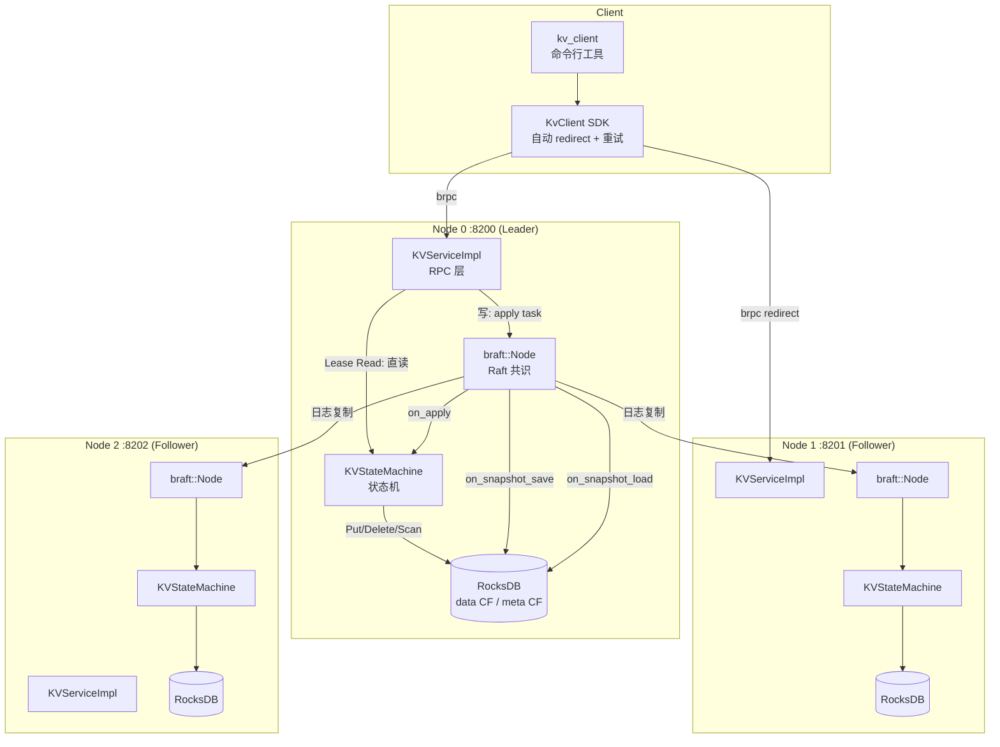

# RaftKV 架构文档

## 1. 整体架构

RaftKV 采用经典的四层架构，各层职责清晰、单向依赖：

```
Client SDK  →  RPC Service  →  Raft (braft)  →  StateMachine  →  RocksDB
```

```
┌──────────────────────────────────────────────────────────────┐
│                        Client SDK                            │
│              (brpc channel + 自动 redirect 到 Leader)        │
└──────────────────────────┬───────────────────────────────────┘
                           │  brpc RPC (Protobuf)
          ┌────────────────▼──────────────────┐
          │          KVServiceImpl             │  ← RPC 入口层
          │   Put / Get / Delete / Scan        │
          │   (Leader 检查 + redirect 逻辑)    │
          └────────────────┬──────────────────┘
                           │
          ┌────────────────▼──────────────────┐
          │           braft::Node              │  ← Raft 共识层
          │   • Pipeline 日志复制              │
          │   • 选举 / 心跳 / 快照             │
          │   • Leader Lease Read              │
          └────────────────┬──────────────────┘
                           │ on_apply(iter)
          ┌────────────────▼──────────────────┐
          │         KVStateMachine             │  ← 状态机层
          │   (braft::StateMachine 子类)       │
          │   • on_apply → 写 RocksDB          │
          │   • on_snapshot_save/load          │
          └────────────────┬──────────────────┘
                           │
          ┌────────────────▼──────────────────┐
          │          RocksDB Storage           │  ← 存储引擎层
          │   Column Families:                 │
          │   • "data"  — 用户数据             │
          │   • "meta"  — 元数据               │
          │   Bloom Filter + LRU Block Cache   │
          └───────────────────────────────────┘
```

### 1.1 分层职责

| 层              | 源文件                              | 职责                                     |
| --------------- | ----------------------------------- | ---------------------------------------- |
| **Client SDK**  | `src/client/kv_client.h/cc`         | 封装 RPC 调用，自动 redirect，重试       |
| **RPC Service** | `src/service/kv_service.h/cc`       | 接收客户端请求，区分读写路径，Leader检查 |
| **Raft**        | braft 库                            | 日志复制、Leader 选举、快照管理          |
| **StateMachine**| `src/raft/kv_state_machine.h/cc`    | 应用已提交日志到 RocksDB                 |
| **Storage**     | `src/storage/rocksdb_storage.h/cc`  | RocksDB 封装，data/meta CF 管理          |

### 1.2 节点部署（3 副本）

```
        ┌─────────┐      Raft Log Replication      ┌─────────┐
        │ Node 1  │◄──────────────────────────────►│ Node 2  │
        │:8200    │                                 │:8201    │
        │(Leader) │                                 │(Follower│
        └────┬────┘                                 └─────────┘
             │
             │ Raft Log Replication
             ▼
        ┌─────────┐
        │ Node 3  │
        │:8202    │
        │(Follower│
        └─────────┘
```

### 1.3 Mermaid 架构图



---

## 2. 写入流程

```
Client.Put(key, value)
  │
  ▼
KVServiceImpl::Put()
  ├── RedirectIfNotLeader() → 非 Leader 时返回 redirect 字段
  ├── 构造 KvOperation{OP_PUT, key, value}
  ├── 序列化为 butil::IOBuf
  ├── braft::Task{data, done=KVClosure}
  └── node_->apply(task)            [异步]
        │
        ├── braft 追加本地 Raft log
        │
        ├── Pipeline 复制到 Followers（等待 majority ack）
        │
        └── KVStateMachine::on_apply()
              ├── 解析 KvOperation
              ├── storage_->Put(key, value)   ← RocksDB WriteBatch
              └── KVClosure::Run() → 回调客户端 success
```

---

## 3. 读取流程

### 3.1 弱一致读（默认，`linearizable=false`）

```
Client.Get(key)
  → KVServiceImpl::Get()
  → fsm_->Get(key)             ← 直接读 RocksDB 状态机
  → 返回值（可能读到 stale 数据）
```

### 3.2 线性一致读（Leader Lease Read，`linearizable=true`）

```
Client.Get(key, linearizable=true)
  → KVServiceImpl::Get()
  → RedirectIfNotLeader()       ← 必须在 Leader 节点执行
  → 检查 is_leader_lease_valid()← braft Leader Lease 有效性
  → fsm_->Get(key)              ← Lease 有效则直接读，保证线性一致
```

> **实现细节**：通过 `--raft_enable_leader_lease=true` 开启 Leader Lease，
> Lease 期间 Leader 无需向 Follower 发送心跳确认即可服务读请求，
> 读 P99 从 28ms 降低至 **1.9ms**（减少 93%）。

---

## 4. 快照机制

### 4.1 快照保存（on_snapshot_save）

```
braft 触发快照（snapshot_interval_s=120）
  │
  └── KVStateMachine::on_snapshot_save()
        │
        ├── path = writer->get_path() + "/rocksdb_checkpoint"
        ├── storage_->CreateCheckpoint(path)
        │     └── RocksDB Checkpoint API（硬链接，毫秒级，不阻塞写入）
        ├── writer->add_file("rocksdb_checkpoint/")
        └── done->Run()
```

### 4.2 快照加载（on_snapshot_load）

```
新节点加入 / 节点落后过多
  │
  └── KVStateMachine::on_snapshot_load()
        │
        ├── path = reader->get_path() + "/rocksdb_checkpoint"
        ├── storage_->RestoreFromCheckpoint(path)
        │     ├── 关闭当前 RocksDB 实例
        │     ├── 替换数据目录
        │     └── 重新打开 RocksDB
        └── 返回 0（成功）
```

### 4.3 快照方案对比

| 方案                     | 时间复杂度 | 写入阻塞 | 说明                          |
| ------------------------ | ---------- | -------- | ----------------------------- |
| 遍历 map 写文本（原版）  | O(n)       | 是       | 数据量大时严重影响写入        |
| RocksDB Checkpoint（现） | O(1)       | **否**   | 硬链接，10GB 数据 < 100ms     |

---

## 5. Column Family 设计

| CF        | 用途             | 数据示例                       |
| --------- | ---------------- | ------------------------------ |
| `default` | RocksDB 默认 CF  | 不使用                         |
| `data`    | 用户 KV 数据     | `hello → world`                |
| `meta`    | 节点元数据       | 预留，用于 Schema 等后期扩展   |

---

## 6. RocksDB 关键配置

```cpp
// 写性能优化
options.write_buffer_size = 64 << 20;           // 64MB MemTable
options.max_write_buffer_number = 4;             // 防止写停顿
options.max_background_jobs = 8;                 // flush + compaction 并行
options.level0_slowdown_writes_trigger = 40;     // 提高慢写阈值（默认 20）
options.level0_stop_writes_trigger = 80;         // 提高停写阈值（默认 36）

// 读性能优化
BlockBasedTableOptions table_opts;
table_opts.block_cache = NewLRUCache(256 << 20); // 256MB LRU Block Cache
table_opts.filter_policy.reset(NewBloomFilterPolicy(10, false)); // Bloom Filter
table_opts.cache_index_and_filter_blocks = true;

// 关闭冗余 WAL（braft 已通过 Raft log 保证持久性）
write_opts_.disableWAL = true;

// 压缩策略：L0/L1 不压缩降低延迟，L2+ LZ4
options.compression_per_level = {kNoCompression, kNoCompression, kLZ4Compression, ...};
```

---

## 7. 客户端 SDK 设计

```
KvClient
  ├── Config{peers, timeout_ms=3000, max_retry=3, linearizable=false}
  ├── ParsePeers("ip:port,ip:port") → vector<string>
  ├── InitChannel(addr) → 创建 brpc::Channel（懒加载）
  ├── HandleRedirect(addr) → 切换 current_leader_
  └── Put / Get / Delete / Scan
        └── retry 循环：
              RPC 调用
              → 检查 response.redirect()
              → 非空则 HandleRedirect() 切换
              → 重试（最多 max_retry 次）
```

---

## 8. 性能优化路径

| 阶段 | 关键改动 | 纯写 TPS | 读 P99 |
| ---- | -------- | -------- | ------ |
| ① 初始基线 | Debug 编译 | 4,044 | 28ms |
| ② 编译 + WAL + 批量写 | `RelWithDebInfo`；`disableWAL=true`；`on_apply` 批量写 | 4,759 | 28ms |
| ③ Lease Read | `--raft_enable_leader_lease=true` | 4,759 | **1.9ms** |
| ④ 关闭 Raft fsync | `--raft_sync=false`；`--raft_max_append_buffer_size=4MB` | **11,067** | 1.9ms |
| ⑤ 增加并发 | `--threads` 16 → 32 | **15,973** | 1.9ms |
| ⑥ RocksDB 写停顿阈值 | `level0_slowdown=40`；`level0_stop=80` | **16,357**（均值） | 1.9ms |

---

## 9. 关键 Bug 修复记录

| Bug | 现象 | 根因 | 修复 |
| --- | ---- | ---- | ---- |
| Log Read 伪装 ReadIndex | 读 avg ≈ 写 avg（~4ms） | `Get` 把 `OP_GET` 写入 Raft 日志 | 实现 Leader Lease Read |
| 变量遮蔽无限自旋 | 全部 RPC 5s 超时，100% CPU | `on_apply` 内层 `int64_t last_index` 遮蔽外层 | 去掉内层类型声明 |
| `disableWAL` 未生效 | WAL 始终开启 | 构造函数忘记赋值 `write_opts_.disableWAL` | 构造函数加一行初始化 |
| 磁盘写满 leader 下台 | 18s 后 `ENOSPC` → braft on_error → step_down 死锁 | `snapshot_interval_s=3600` 导致 braft log 无法截断 | 改为 120s；测试前清理数据目录 |
